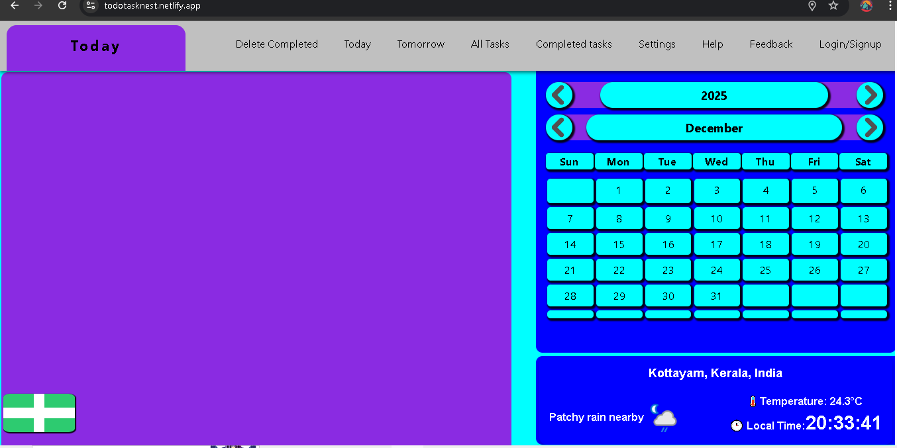
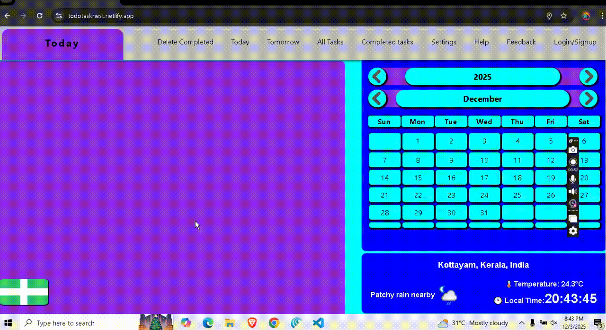
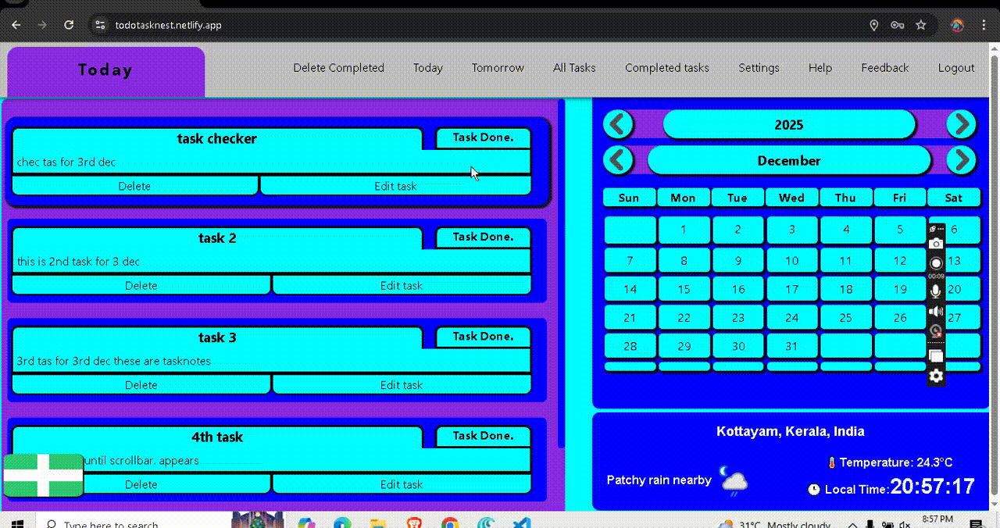

# TaskNest

## Description

**TaskNest** -- *a simple focused todo / task manager with a calender-first UX.*
* Built with **Vanilla javascript** (≈ 1400 lines of code), HTML & CSS on the frontend and 
**Node.js + Express + MongoDB** on the backend.The project purposefully avoids front-end frameworks so I can learn and inspect DOM manipulation, event listeners and client-side state handling end-to-end.  

## Demo & Repo

- GitHub: https://github.com/TechSwimmer/Todo-list-app
- Live frontend (deployed on Netlify): https://todotasknest.netlify.app/
- Personal site / contact: https://techdevnikhil.netlify.app/

**Calendar + Today view**

            

**Create task modal**

            

**Edit task modal**

            

## Table of Contents

- [Why this project](#why-this-project)
- [Features](#features)
- [Tech Stack](#tech-stack)
- [Architecture & Calendar behavior](#architecture--calendar-behavior)
- [API Endpoints (server routes)](#api-endpoints-server-routes)
- [Installation & Local Development](#installation--local-development)
- [Environment variables](#environment-variables)
- [Security Notes](#security-notes)
- [Future Improvements](#future-improvements)
- [Contributing](#contributing)
- [License](#license)
- [Contact](#contact)

## Why this project

I built **Tasknest to deeply understand DOM APIs, event delegation, and client-side server flows without abstracting them away with a frontend framework.** The codebase intentionally contains a large amount of **vanilla JS (≈ 1400 lines of code)** so you can see real-world patterns for:

- Centralised DOM caching. 
- Calendar rendering logic.
- Event delegation vs attaching per-element listeners.
- REST API interaction  with auth tokens.
- Basic UI/UX patterns for small apps

### Features

* *Add tasks with due dates*

* *Edit and delete tasks*

* *Mark tasks as completed*

* *Calendar view: select Date -> see tasks for that Date.*

* *Filter quick-views: Today / Tomorrow / All Tasks / Completed*

* *Simple authentication (register & login)*

* *Feedback form (sends email via backend)*

* *Responsive behavior — compact nav for smaller screens*

* ***Smart Weather Widget*** -- *Automatically detects user location (with permission), fetches current weather and displays local time with a live ticking clock*  
- Uses HTML5 Geolocation API to detect user’s location (when permitted)
- Fetches current weather data from WeatherAPI.com
- Displays:
  - Temperature
  - Condition + Icon
  - City / Region / Country
  - Local time (Updated every second with live javascript clock)
- Incudes falback behaviour
  - If location access denied or API fails, the widgest still shows system time and a "Weather Unavailable" message.


## Tech Stack

### Frontend

* HTML, CSS, plain JavaScript (no framework)
* Single-page behaviors handled with DOM + event listeners


### Backend

* Node.js + Express.js
* MongoDB (Atlas)
* Nodemailer for feedback emails


### Auth & Security

* JWT-based authentication
* Password hashing with `bcrypt`

### Deployment

* Frontend: Netlify
* Backend: Render

## Architeture & Calendar behaviour

### High-level

* Frontend calls backend under `/api/...` for protected actions.
* Frontend stores `authToken` (JWT) and `userID` in `localStorage`.
* Calendar is rendered by creating `<tr>` / `<td>` elements in JS, with at most 6 rows (weeks) and 7 columns (days).
* Calendar interaction uses **event delegation** on the calendar body (`#table-body`) where possible to avoid re-attaching listeners every re-render.
* When a date is selected the app highlights the cell and calls `/api/user/tasks/fetch` with the selected date to load tasks.


### Important calendar notes

* Months are shown by name (array `months[]`) and converted to month number when calling APIs.
* Dates in UI are compared to `today` / `tomorrow` using canonical `YYYY-M-D` or `YYYY-M-DD` as appropriate — there's a helper `formatDate()` to normalize comparisons.
* Rendering functions clear `tableBody` and re-create cells each month change.

## API Endpoints (server routes)

*These are the Routes the current frontend expects (base* `BASE_URL/api` *path)*

### Auth

* `POST /api/auth/user/register` -- Register (return token and userID)
* `POST /api/auth/user/login`    -- Login (returns token & userID)

### Tasks

* `POST /api/user/tasks/add`  --  add task (protected)
* `GET /api/user/tasks/fetch?year=&month=&day=&userID=` -- fetch tasks for a specific date (protected)
* `GET /api/user/tasks/alltasks` --  fetch all tasks for user (protected)
* `PUT /api/user/tasks/update/:id`  -- update a specific task (protected)
* `DELETE /api/user/tasks/delete/:id`  -- delete a specific tas (protected)

### Other

* `PATCH /api/tasks/completed/:id` -- mark task completed (protected)
* `DELETE /api/tasks/delete-completed` -- delete all completed tasks (protected)
* `POST /api/submit-feedback` -- submit feedback (sends email; optional DB model - current setup sends email)

> Note: the front-end expects `Authorization: Bearer <token>` header on protected routes and `userid` header (some calls).

## Installation & Local Development

> The repo contains where you find the backend and a public repo where ou can find frontend.

### Prerequisites

* Node.js (v16+ recommended) and npm
* MongoDB Atlas or a local MongoDB database set up
* An SMTP account (for feedback email) — Gmail with app password works well

### Setup Backend & Frontend

1. clone the repo:

```

 `git clone https://github.com/TechSwimmer/Todo-list-app.git`
 

```
2. change into the folder and Install dependencies:

```

 `git clone https://github.com/TechSwimmer/Todo-list-app.git`
 `cd Todo-list-app`
 `npm install`

```

3. Create `.env` with required variables 

```

`MONGO_URI=your_mongodb_connection_string`
`JWT_SECRET=your_jwt_secret`
`EMAIL_USER=your_email_here`   # required for feedback emails
`EMAIL_PASS=your_email_app_password`
`PORT=3000`

```
4. Configure the CONFIG.js file to use the backend render url

```

  const CONFIG = {
    backendURL: 'https://render-bacend-url.com'
  }

```

5. Start server

`npm run dev`

6. Open browser

`http://localhost:3000/`

**Notes:**
* For Gmail use: reate an App Password (recommended) and set EMAIL_PASS to the app password. if using 2FA-less acounts.
* Enusre the Render environment variables match these keys.

## Security notes

* Backend: Render (HTTPS). Frontend: Netlify (HTTPS).
* CORS enabled on backend to allow frontend origin.
* Passwords stored hashed with bcrypt.
* JWT-based authentication. Currently the JWT has no expiry (token persists until removed).
* The frontend stores token and userID in localStorage.
* Users can only CRUD their own tasks via server-side checks.
* Login attempts currently unlimited 

## Future Improvements

*Short term*
* Add JWT expiry + refresh token flow
* Add rate-limiting (login) with express-rate-limit
* Move token to HttpOnly cookie to reduce XSS risk
* Add unit tests for backend routes (Jest / Supertest)
* Improve UI feedback (toasts instead of alert)
* Improve calendar UX: show month/year selector, keyboard navigation

*Medium/Long term*
* Add offline support (service worker) and local sync (merge local tasks on reconnect)
* Add calendar events with drag-and-drop and recurring tasks
* Add reminders & push notifications
* Add user profile & settings (time zone, locale)
* Add analytics / usage dashboard

## License

* This project is released under the **MIT Liense.** See license for details. 

## Contact
* GitHub: https://github.com/TechSwimmer/Todo-list-app
* Personal site: https://techdevnikhil.netlify.app/